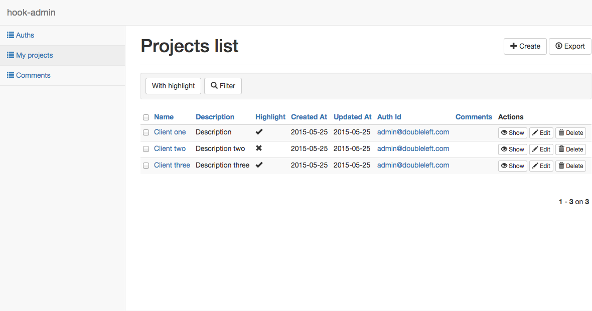

hook-admin
===

Administrator interface for [hook](https://github.com/doubleleft/hook). Built on
top of [marmelab/ng-admin](https://github.com/marmelab/ng-admin).

[]()

Features
---

- Auto-analyze hook's `schema.yaml`
- A [single config file](app/config/app.yaml) to customize collection fields.

How to use
---

1. Install [hook](https://github.com/doubleleft/hook#installation). Make sure
   that hook server is running locally (`hook server`)
2. Create an application (`hook app:new admin`)
3. Deploy the application (`hook deploy`)
4. Seed the application's database (`hook db:seed`)
5. Install npm dependencies (`npm install`)
6. Start the administrator panel (`HOOK_EXT=./hook-ext npm start`)

You need to specify your target `hook-ext` directory on `HOOK_EXT` environment
variable. For testing purpose, use the relative [./hook-ext](hook-ext) on this
repository.

Production build:

```
gulp build
```

License
---

MIT
